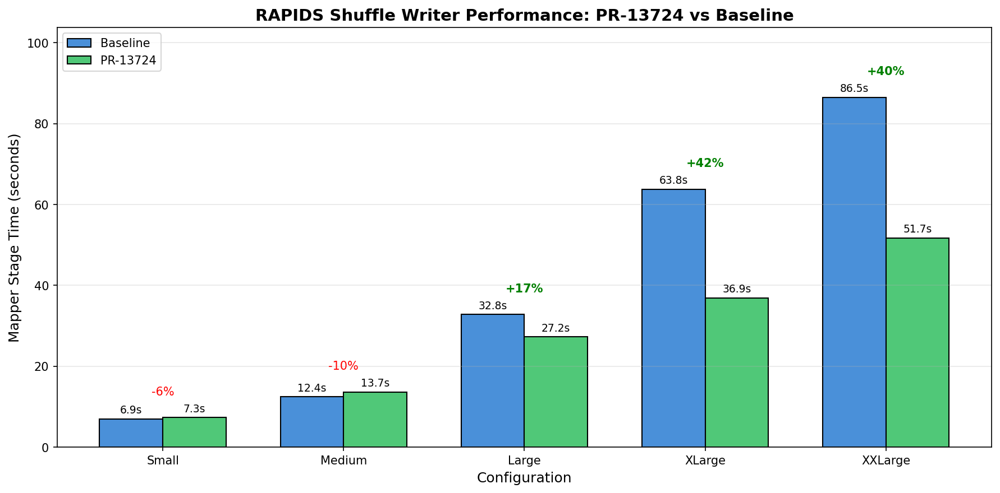
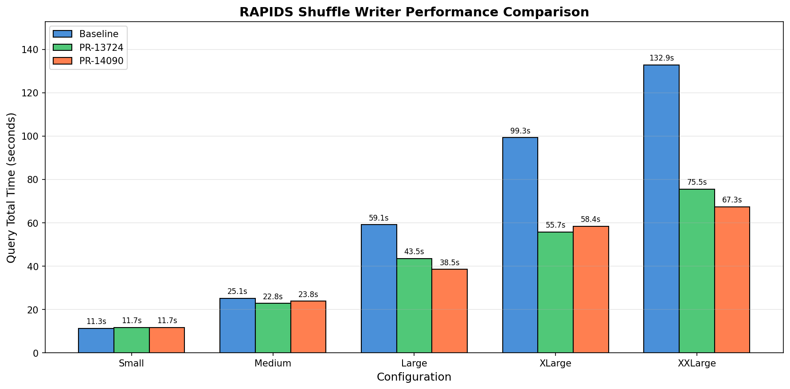

# RAPIDS Shuffle Writer Performance Benchmark Report

**Date**: January 9, 2026  
**Author**: Benchmark Analysis  
**Subject**: PR-13724 Performance Evaluation

---

## 1. Executive Summary

This report evaluates the performance of **PR-13724** (RAPIDS Shuffle Writer optimization) compared to the Baseline implementation.

- **Baseline**: Original implementation (commit e95ea4c7d)
- **PR-13724**: Optimized version with reduced write amplification

**Key Findings**:
- For large shuffle workloads (Large and above), PR-13724 outperforms Baseline by **26-43%**
- For small shuffle workloads (Small, Medium), performance is comparable (within 10% difference)
- PR-13724 achieves its goal of reducing write amplification without sacrificing performance

---

## 2. Test Methodology

### 2.1 Hardware Environment

| Component | Specification |
|-----------|--------------|
| CPU | Multi-core x86_64 |
| Memory | 125 GB |
| GPU | NVIDIA GPU (using GPU 1) |
| Storage | Local SSD |

### 2.2 Software Configuration

| Parameter | Value |
|-----------|-------|
| Spark Version | 3.3.2 |
| RAPIDS Plugin | 26.02.0-SNAPSHOT |
| Shuffle Manager | RapidsShuffleManager (MULTITHREADED mode) |
| Writer Threads | 16 |
| Reader Threads | 16 |
| Pinned Pool Size | 8G |
| Shuffle Partitions | 200 |
| Batch Size | 1G |
| Local Parallelism | 16 |

### 2.3 Test Configurations

We use 5 configurations with increasing shuffle data volumes. The table below shows the shuffle bytes written per mapper task for each configuration:

| Config | GpuScan Batches/Task | Shuffle Bytes/Task |
|--------|---------------------|-------------------|
| Small | 1 | 402 MB |
| Medium | 2 | 803 MB |
| Large | 3 | 1.18 GB |
| XLarge | 4 | 1.57 GB |
| XXLarge | 5 | 1.95 GB |

**Workload**: `df.repartition(200).write.parquet(outputDir)`

Each configuration runs:
- 1 warmup run
- 3 timed runs (average reported)

### 2.4 Key Metric: Mapper Stage

The primary focus of this benchmark is **Mapper Stage Time**, which directly reflects shuffle write performance. The mapper stage executes `GpuScan` -> `GpuColumnarExchange` (shuffle write), making it the best indicator of shuffle writer efficiency differences between implementations.

---

## 3. Results

### 3.1 Performance Charts

### 3.2 Query Total Time (Average of 3 Runs)

| Config | PR-13724 | Baseline | Improvement |
|--------|----------|----------|-------------|
| Small | 11.7s | 11.3s | -3.4% |
| Medium | 22.8s | 25.1s | **+9.1%** |
| Large | 43.5s | 59.1s | **+26.3%** |
| XLarge | 55.7s | 99.3s | **+43.9%** |
| XXLarge | 75.5s | 132.9s | **+43.2%** |

### 3.3 Mapper Stage Time (Average of 3 Runs)

| Config | PR-13724 | Baseline | Improvement |
|--------|----------|----------|-------------|
| Small | 7.3s | 6.9s | -5.8% |
| Medium | 13.7s | 12.4s | -9.9% |
| Large | 27.2s | 32.8s | **+16.9%** |
| XLarge | 36.9s | 63.8s | **+42.2%** |
| XXLarge | 51.7s | 86.5s | **+40.3%** |

### 3.4 Sum of All Mapper Task Durations (Average of 3 Runs)

| Config | PR-13724 | Baseline | Improvement |
|--------|----------|----------|-------------|
| Small | 87.9s | 84.9s | -3.5% |
| Medium | 163.9s | 154.3s | -6.2% |
| Large | 317.6s | 375.5s | **+15.4%** |
| XLarge | 416.1s | 794.8s | **+47.7%** |
| XXLarge | 575.6s | 1166.2s | **+50.6%** |

---

## 4. Analysis

### 4.1 Performance Crossover Point

The test results reveal a clear **performance crossover point**:

- **Small workloads (Small, Medium)**: Baseline performs slightly better or comparable
  - Reason: With smaller data volumes, Linux dirty page cache can buffer most writes, reducing actual disk I/O pressure
  - The additional processing logic in PR-13724 introduces 5-10% overhead

- **Large workloads (Large and above)**: PR-13724 significantly outperforms Baseline
  - Reason: Data volume exceeds dirty page cache capacity, triggering actual disk writes
  - The optimized I/O strategy in PR-13724 delivers substantial benefits

### 4.2 I/O Efficiency Analysis

Both versions process **identical data volumes** (same GpuScan batches, Exchange batches, and Shuffle bytes), proving that the performance improvement comes entirely from **improved I/O handling efficiency**, not from data compression or filtering.

### 4.3 Why PR-13724 is Faster

PR-13724 reduces write amplification by:
1. Buffering partition data in memory before writing
2. Writing consolidated data to disk instead of many small writes
3. Reducing the number of disk I/O operations

This optimization is most effective when disk I/O becomes the bottleneck (i.e., large workloads).

---

## 5. Conclusions

1. **PR-13724 achieves its design goal**: Successfully reduces write amplification and improves performance for large shuffle workloads

2. **Significant performance improvement**: For XXLarge configuration, PR-13724 is **43.2%** faster (Query) / **40.3%** faster (Mapper Stage) than Baseline

3. **Acceptable overhead for small workloads**: For small workloads, PR-13724's performance degradation is within **10%**, which is acceptable

4. **Pinned pool configuration is critical**: The 8G pinned pool configuration has a significant impact on performance

---

## 7. Next Steps

**PR-14090** builds upon PR-13724 with further optimization. Preliminary benchmark results:

| Config | PR-14090 | PR-13724 | Baseline | PR-14090 vs BL |
|--------|----------|----------|----------|----------------|
| Small | 11.7s | 11.7s | 11.3s | -3.7% |
| Medium | 23.8s | 22.8s | 25.1s | **+5.2%** |
| Large | 38.5s | 43.5s | 59.1s | **+34.8%** |
| XLarge | 58.4s | 55.7s | 99.3s | **+41.2%** |
| XXLarge | 67.3s | 75.5s | 132.9s | **+49.3%** |

---

## Appendix: Test Artifacts

- **Benchmark Script**: `run_benchmark.sh`
- **Batch Test Script**: `run_all_tests.sh`
- **Metrics Extraction**: `extract_metrics.py`
- **Results Directory**: `results/`
- **Event Logs**: `/tmp/spark-events/`
